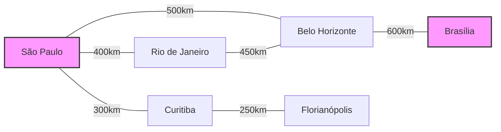

# JavaScript A* (A-Star) Path Finding Algorithm

## Overview
This repository contains a JavaScript implementation of the A* (A-Star) pathfinding algorithm. A* is an efficient and popular pathfinding algorithm that combines the advantages of Breadth-First Search's heuristic approach with Dijkstra's algorithm's formal methodology to find the optimal path between two points in a graph.


## Features
- Pure JavaScript implementation
- Works with weighted graphs
- Supports custom heuristic functions
- Returns the optimal path when one exists
- Memory efficient using Set data structure for closed list

## Algorithm Background
The A* algorithm, first described in 1968 by Peter Hart, Nils Nilsson, and Bertram Raphael, is widely used in:
- Navigation and route-finding systems
- Video games for character pathfinding
- Robotics for motion planning
- Puzzle-solving applications

The algorithm works by maintaining two lists (open and closed) and uses a heuristic function to estimate the distance to the goal, making it more efficient than traditional pathfinding algorithms.

## Installation

```bash
npm install javascript-grafo-astar
```

## Usage / Examples

### Basic
```javascript
const AStar = require('javascript-grafo-astar');

// Define your graph
const graph = {
  A: {
    B: { weight: 4, distance: 4 },
    C: { weight: 2, distance: 2 }
  },
  B: {
    A: { weight: 4, distance: 4 },
    D: { weight: 3, distance: 3 }
  },
  C: {
    A: { weight: 2, distance: 2 },
    D: { weight: 1, distance: 1 }
  },
  D: {
    B: { weight: 3, distance: 3 },
    C: { weight: 1, distance: 1 }
  }
};

// Create a new instance
const astar = new AStar(graph, 'A', 'D');

// Find the path
const path = astar.findPath();
console.log(path); // ['A', 'C', 'D']
```

### City Navigation Example
This example demonstrates how to use the A* algorithm to find the shortest path between Brazilian cities.

```javascript
// Importing AStar class
const AStar = require('./astar');

// Example 1: City Navigation
function citiesExample() {
    // Graph representing cities and their connections
    // weight represents distance in km and distance is the straight-line distance to destination
    const cityMap = {
        'SaoPaulo': {
            'RioDeJaneiro': { weight: 400, distance: 350 },
            'BeloHorizonte': { weight: 500, distance: 480 },
            'Curitiba': { weight: 300, distance: 280 }
        },
        'RioDeJaneiro': {
            'SaoPaulo': { weight: 400, distance: 350 },
            'BeloHorizonte': { weight: 450, distance: 420 }
        },
        'BeloHorizonte': {
            'SaoPaulo': { weight: 500, distance: 480 },
            'RioDeJaneiro': { weight: 450, distance: 420 },
            'Brasilia': { weight: 600, distance: 580 }
        },
        'Curitiba': {
            'SaoPaulo': { weight: 300, distance: 280 },
            'Florianopolis': { weight: 250, distance: 220 }
        },
        'Florianopolis': {
            'Curitiba': { weight: 250, distance: 220 }
        },
        'Brasilia': {
            'BeloHorizonte': { weight: 600, distance: 580 }
        }
    };

    const astar = new AStar(cityMap, 'SaoPaulo', 'Brasilia');
    const path = astar.findPath();
    console.log('Best route from SaoPaulo to Brasilia:', path);
}
```

#### Visual Representation of the Cities Graph
Below is a visualization of the cities and their connections. The numbers on the edges represent the distance in kilometers between cities.



In this example, when finding the path from São Paulo to Brasília, the algorithm will determine that the optimal route is:
`São Paulo → Belo Horizonte → Brasília`


### Graph Structure
The graph should be structured as an adjacency list where each node contains its neighbors with their respective weights and distances:

```javascript
{
  nodeA: {
    nodeB: { weight: number, distance: number },
    nodeC: { weight: number, distance: number }
  },
  // ... more nodes
}
```

- `weight`: The cost of moving from one node to another
- `distance`: The straight-line distance to the goal (used for heuristic)

## API Reference

### `AStar` Class

#### Constructor
```javascript
new AStar(graph, startNode, goalNode)
```

#### Parameters
- `graph`: Object representing the graph structure
- `startNode`: Starting node identifier
- `goalNode`: Goal node identifier

#### Methods
- `findPath()`: Returns an array representing the optimal path from start to goal
- `heuristic(node)`: Calculates the heuristic value for a given node
- `reconstructPath(current)`: Reconstructs the path from the goal node back to the start

## How It Works

1. The algorithm maintains two lists:
   - `openList`: Nodes to be evaluated
   - `closedList`: Nodes already evaluated

2. For each node, it calculates:
   - `g(n)`: The cost from the start node to the current node
   - `h(n)`: The estimated cost from the current node to the goal (heuristic)
   - `f(n)`: The total cost `g(n) + h(n)`

3. The algorithm continuously selects the node with the lowest `f(n)` value until it reaches the goal or determines no path exists.

## Contributing

Contributions are welcome! Please feel free to submit a Pull Request.

## License

This project is licensed under the MIT License - see the LICENSE file for details.